# VoipGlot Windows

Real-time audio translation for Windows gaming and VOIP applications.

## 🚀 Project Status

**✅ Core Components Successfully Tested**

All three core components of the VoipGlot pipeline have been successfully implemented and tested as individual Proof of Concept (PoC) applications:

- **✅ VOSK STT**: Real-time speech recognition with automatic device detection
- **✅ CTranslate2 Translation**: Offline translation with NLLB-200 model (200+ languages)
- **✅ Coqui TTS**: Real-time speech synthesis with audio output

**🔄 Current Phase: Pipeline Integration**

The next development phase involves integrating all tested components into a complete audio translation pipeline.

## 🏗️ Audio Pipeline Architecture

```mermaid
graph TB
    subgraph "Audio Input"
        MIC[🎤 Real Microphone<br/>16kHz Mono Audio]
    end
    
    subgraph "VoipGlot Core Pipeline"
        AC[🎵 Audio Capture<br/>Real-time Buffering]
        STT[🗣️ VOSK STT<br/>Speech Recognition]
        TRANS[🌐 CTranslate2<br/>NLLB-200 Translation]
        TTS[🔊 Coqui TTS<br/>Speech Synthesis]
        AP[🎧 Audio Playback<br/>Virtual Output]
    end
    
    subgraph "Audio Output"
        VM[🎛️ VB-CABLE<br/>Virtual Microphone]
        APP[🎮 Target Applications<br/>Games/Discord/Zoom]
    end
    
    MIC --> AC
    AC --> STT
    STT --> TRANS
    TRANS --> TTS
    TTS --> AP
    AP --> VM
    VM --> APP
    
    style MIC fill:#e1f5fe
    style VM fill:#e1f5fe
    style APP fill:#e1f5fe
    style STT fill:#e8f5e8
    style TRANS fill:#e8f5e8
    style TTS fill:#e8f5e8
```



## 📋 Quickstart

### Testing Individual Components

Each core component can be tested independently. See their respective README files for detailed instructions:

#### 1. Speech-to-Text (VOSK)
```powershell
cd tests/stt-vosk
.\build.ps1 -SetupEnv -DownloadModel
cargo run --release
```
📖 **Documentation**: [tests/stt-vosk/README.md](tests/stt-vosk/README.md)

#### 2. Translation (CTranslate2)
```powershell
cd tests/translation-ct2
.\build.ps1
cargo run --release
```
📖 **Documentation**: [tests/translation-ct2/README.md](tests/translation-ct2/README.md)

#### 3. Text-to-Speech (Coqui)
```powershell
cd tests/tts-coqui
.\build.ps1
cargo run --release
```
📖 **Documentation**: [tests/tts-coqui/README.md](tests/tts-coqui/README.md)

### Prerequisites

1. **Windows**: Developer PowerShell environment
2. **Python**: 3.8-3.12 (for CTranslate2)
3. **CMake**: 3.28.3 (for CTranslate2)
4. **Rust**: 2021 edition or later
5. **VOSK**: Library and models (automated download)
6. **Coqui TTS**: Python package (automated installation)

### Main Application (In Development)

```powershell
# Clone the repository
git clone <repository-url>
cd voipglot-win

# Build the main application
.\build-windows.ps1

# Run the application
.\target\x86_64-pc-windows-msvc/release/voipglot-win.exe
```

## 📚 Documentation

- [**PoC Status**](docs/poc-status.md) - Detailed status of tested components
- [**Features**](docs/features.md) - Current and planned features
- [**Architecture**](docs/architecture.md) - System architecture and data flow
- [**Configuration**](docs/configuration.md) - Configuration management
- [**Usage & Optimization**](docs/usage.md) - Usage guidelines and optimization
- [**AI Providers & Languages**](docs/providers.md) - Supported AI providers and languages
- [**Troubleshooting**](docs/troubleshooting.md) - Common issues and solutions
- [**Performance**](docs/performance.md) - Performance characteristics and optimization
- [**Roadmap**](docs/roadmap.md) - Development roadmap and future plans

## 🎯 Current Capabilities

### ✅ Tested and Working
- **Real-time audio capture** from physical microphones
- **Offline speech recognition** using VOSK (20+ languages)
- **Offline translation** using CTranslate2 with NLLB-200 (200+ languages)
- **Real-time speech synthesis** using Coqui TTS
- **Automated setup scripts** for all components
- **Cross-platform audio handling** with CPAL
- **Comprehensive error handling** and logging

### 🔄 In Development
- **Pipeline integration** of all tested components
- **Virtual microphone output** (VB-CABLE integration)
- **End-to-end latency optimization**
- **Graphical user interface**

## 📈 Performance Characteristics

- **STT Latency**: Real-time processing (< 100ms)
- **Translation Speed**: 10-50ms per sentence
- **TTS Generation**: 100-500ms for sentence generation
- **Memory Usage**: 3-6GB total (model dependent)
- **CPU Usage**: Moderate, with GPU acceleration support

## 🤝 Contributing

The project is currently in active development. All core components have been successfully tested and the focus is now on pipeline integration and performance optimization.

## 📄 License

This project is licensed under the MIT License - see the LICENSE file for details. 