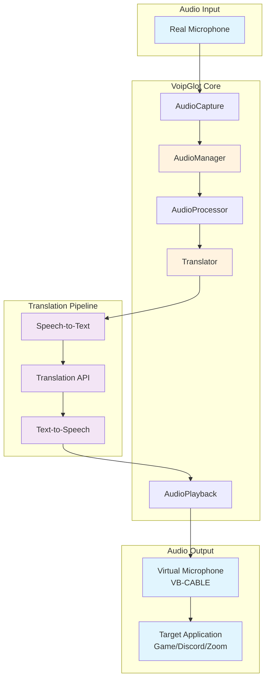
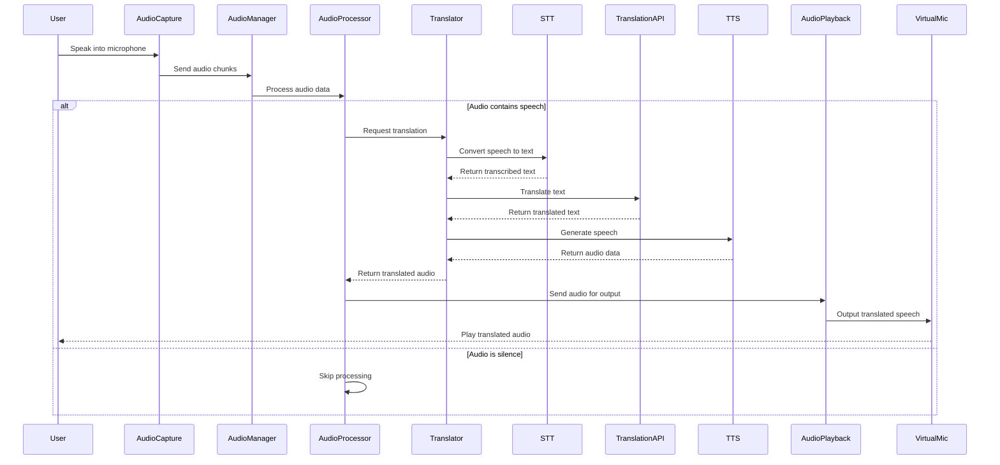
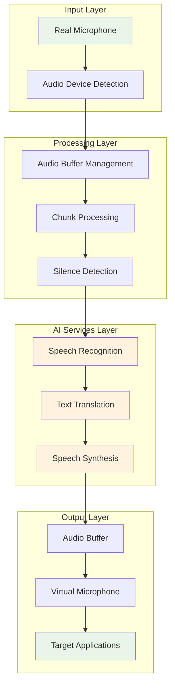

# Architecture

## System Architecture



## Audio Pipeline Flow

```mermaid
flowchart LR
    subgraph "1. Audio Capture"
        A1[Microphone Input]
        A2[Audio Buffer]
        A3[Chunk Processing]
    end
    
    subgraph "2. Preprocessing"
        B1[Noise Reduction]
        B2[Silence Detection]
        B3[Audio Normalization]
    end
    
    subgraph "3. Speech Recognition"
        C1[STT Processing]
        C2[Text Extraction]
    end
    
    subgraph "4. Translation"
        D1[Text Translation]
        D2[Language Conversion]
    end
    
    subgraph "5. Speech Synthesis"
        E1[TTS Processing]
        E2[Audio Generation]
    end
    
    subgraph "6. Audio Output"
        F1[Audio Buffer]
        F2[Virtual Microphone]
        F3[Target Application]
    end
    
    A1 --> A2 --> A3
    A3 --> B1 --> B2 --> B3
    B3 --> C1 --> C2
    C2 --> D1 --> D2
    D2 --> E1 --> E2
    E2 --> F1 --> F2 --> F3
    
    style A1 fill:#e3f2fd
    style F3 fill:#e8f5e8
    style C1 fill:#fff3e0
    style D1 fill:#fff3e0
    style E1 fill:#fff3e0
```



## Component Interaction Diagram



## Core Components
- **AudioManager**: Orchestrates audio capture and playback
- **AudioCapture**: Handles real microphone input
- **AudioPlayback**: Outputs to virtual microphone
- **AudioProcessor**: Manages the translation pipeline
- **Translator**: Coordinates STT, translation, and TTS

## Audio Pipeline
1. **Capture**: Real-time audio from microphone
2. **Preprocessing**: Noise reduction, silence detection
3. **STT**: Convert speech to text
4. **Translation**: Translate text to target language
5. **TTS**: Convert translated text to speech
6. **Playback**: Output to virtual microphone

## Project Structure
```
voipglot-win/
├── src/
│   ├── main.rs              # Application entry point
│   ├── error.rs             # Error handling
│   ├── config.rs            # Configuration management
│   ├── audio/               # Audio processing modules
│   │   ├── mod.rs
│   │   ├── capture.rs       # Audio capture
│   │   ├── playback.rs      # Audio playback
│   │   └── processing.rs    # Audio processing pipeline
│   └── translation/         # AI translation modules
│       ├── mod.rs
│       ├── stt.rs           # Speech-to-text
│       ├── translator_api.rs # Text translation
│       └── tts.rs           # Text-to-speech
├── Cargo.toml               # Rust dependencies
├── config.toml              # Configuration file
└── README.md               # This file
```

## Data Flow Architecture

