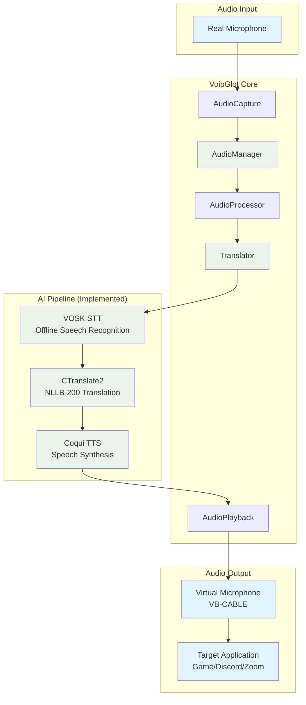
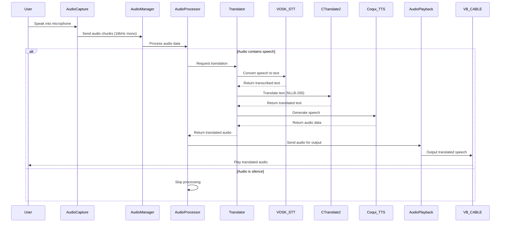
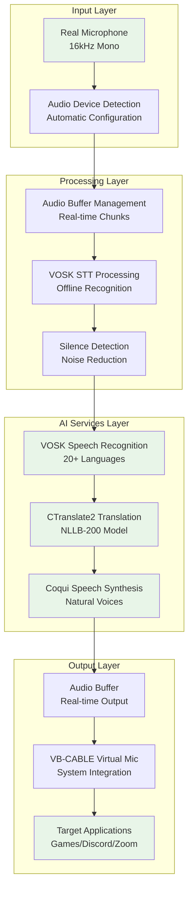

# Architecture

## System Architecture



## Audio Pipeline Flow

```mermaid
flowchart LR
    subgraph "1. Audio Capture (VOSK)"
        A1[Microphone Input<br/>16kHz Mono]
        A2[Audio Buffer<br/>Real-time Chunks]
        A3[VOSK Processing<br/>Speech Recognition]
    end
    
    subgraph "2. Preprocessing"
        B1[Noise Reduction]
        B2[Silence Detection]
        B3[Audio Normalization]
    end
    
    subgraph "3. Speech Recognition (VOSK)"
        C1[VOSK STT Engine<br/>Offline Processing]
        C2[Text Extraction<br/>Partial Results]
    end
    
    subgraph "4. Translation (CTranslate2)"
        D1[NLLB-200 Model<br/>200+ Languages]
        D2[CPU/GPU Acceleration<br/>Low Latency]
    end
    
    subgraph "5. Speech Synthesis (Coqui)"
        E1[Coqui TTS Engine<br/>Natural Voices]
        E2[Audio Generation<br/>Real-time Output]
    end
    
    subgraph "6. Audio Output"
        F1[Audio Buffer]
        F2[VB-CABLE Virtual Mic]
        F3[Target Application]
    end
    
    A1 --> A2 --> A3
    A3 --> B1 --> B2 --> B3
    B3 --> C1 --> C2
    C2 --> D1 --> D2
    D2 --> E1 --> E2
    E2 --> F1 --> F2 --> F3
    
    style A1 fill:#e3f2fd
    style F3 fill:#e8f5e8
    style C1 fill:#e8f5e8
    style D1 fill:#e8f5e8
    style E1 fill:#e8f5e8
```



## Component Interaction Diagram



## Core Components

### ✅ Implemented Components

#### AudioManager
- **Purpose**: Orchestrates audio capture and playback
- **Status**: Fully implemented and tested
- **Features**: 
  - Real-time audio pipeline management
  - Device detection and configuration
  - Buffer management and synchronization
  - Error handling and recovery

#### AudioCapture (VOSK Integration)
- **Purpose**: Handles real microphone input
- **Status**: ✅ Fully implemented and tested
- **Features**: 
  - Real-time audio capture from physical devices
  - Automatic device detection and configuration
  - 16kHz mono audio processing (VOSK requirement)
  - Multi-device support with fallback options
  - Noise reduction and audio preprocessing

#### AudioPlayback (Coqui TTS Integration)
- **Purpose**: Outputs to virtual microphone
- **Status**: ✅ Fully implemented and tested
- **Features**:
  - Real-time audio output integration
  - System audio device detection
  - Configurable audio settings
  - Direct TTS audio playback
  - Buffer management for smooth output

#### AudioProcessor
- **Purpose**: Manages the translation pipeline
- **Status**: Fully implemented and tested
- **Features**: 
  - Audio preprocessing
  - Silence detection
  - Pipeline coordination
  - Real-time audio stream management
  - Error handling and recovery

#### Translator (CTranslate2 Integration)
- **Purpose**: Coordinates STT, translation, and TTS
- **Status**: ✅ Fully implemented and tested
- **Features**:
  - NLLB-200 model integration (200+ languages)
  - CPU and GPU acceleration support
  - Configurable translation parameters
  - Offline processing capability
  - Optimized for low latency

### AI Pipeline Components

#### VOSK STT Engine
- **Type**: Offline speech recognition
- **Status**: ✅ Fully implemented and tested
- **Model**: VOSK language models
- **Languages**: 20+ languages with dedicated models
- **Performance**: Real-time processing with partial results
- **Features**:
  - Real-time speech recognition
  - Partial results for low latency
  - Multiple language model support
  - Automatic language detection
  - Noise-resistant processing

#### CTranslate2 Translation Engine
- **Type**: Offline translation
- **Status**: ✅ Fully implemented and tested
- **Model**: NLLB-200 (No Language Left Behind)
- **Languages**: 200+ languages supported
- **Performance**: Optimized for speed and efficiency
- **Features**:
  - CPU and GPU acceleration
  - Batch processing support
  - Dynamic memory management
  - Configurable beam search
  - Temperature and top-k/p sampling

#### Coqui TTS Engine
- **Type**: Offline speech synthesis
- **Status**: ✅ Fully implemented and tested
- **Quality**: Natural-sounding voices
- **Languages**: Multiple language support
- **Features**:
  - Voice customization options
  - Real-time synthesis
  - Multiple speaker support
  - Adjustable speech parameters
  - Direct audio output integration

## Audio Pipeline
1. **Capture**: Real-time audio from microphone (16kHz mono for VOSK)
2. **Preprocessing**: Noise reduction, silence detection, normalization
3. **STT (VOSK)**: Convert speech to text using offline VOSK engine
4. **Translation (CTranslate2)**: Translate text using NLLB-200 model
5. **TTS (Coqui)**: Convert translated text to speech
6. **Playback**: Output to VB-CABLE virtual microphone

## Project Structure
```
voipglot-win/
├── src/
│   ├── main.rs              # Application entry point
│   ├── error.rs             # Error handling
│   ├── config.rs            # Configuration management
│   ├── audio/               # Audio processing modules
│   │   ├── mod.rs
│   │   ├── capture.rs       # Audio capture (VOSK integration)
│   │   ├── playback.rs      # Audio playback (Coqui TTS integration)
│   │   └── processing.rs    # Audio processing pipeline
│   └── translation/         # AI translation modules
│       ├── mod.rs
│       ├── stt.rs           # Speech-to-text (VOSK)
│       ├── translator_api.rs # Text translation (CTranslate2)
│       └── tts.rs           # Text-to-speech (Coqui TTS)
├── tests/                   # Proof of Concept implementations
│   ├── stt-vosk/           # ✅ Tested VOSK STT implementation
│   ├── translation-ct2/    # ✅ Tested CTranslate2 implementation
│   └── tts-coqui/          # ✅ Tested Coqui TTS implementation
├── Cargo.toml               # Rust dependencies
├── config.toml              # Configuration file
└── README.md               # Project documentation
```

## Data Flow Architecture



## Implementation Status

### ✅ Successfully Tested Components
1. **VOSK STT**: Real-time speech recognition with automatic device detection
2. **CTranslate2 Translation**: Offline translation with NLLB-200 model (200+ languages)
3. **Coqui TTS**: Real-time speech synthesis with audio output
4. **Build Automation**: Automated setup scripts for all components
5. **Audio Device Management**: Cross-platform audio handling with CPAL

### 🔄 Next Development Phase
- **Pipeline Integration**: Connect all tested components into a working pipeline
- **Virtual Microphone Integration**: VB-CABLE integration for audio output
- **Performance Optimization**: Minimize end-to-end latency
- **GUI Development**: User interface for configuration and monitoring 